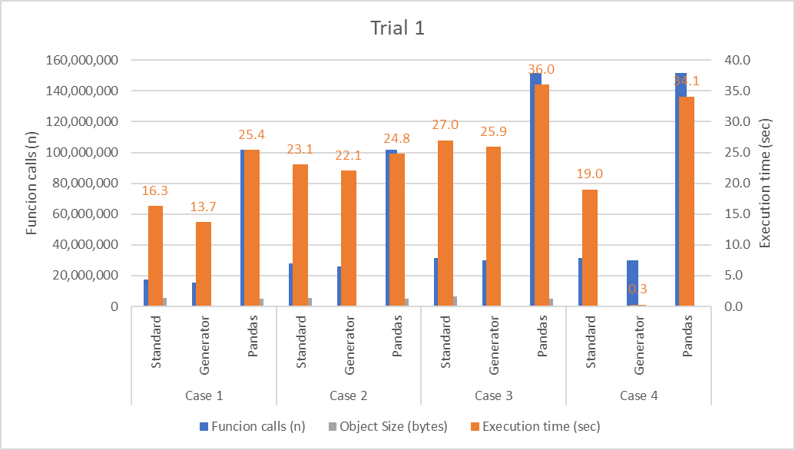
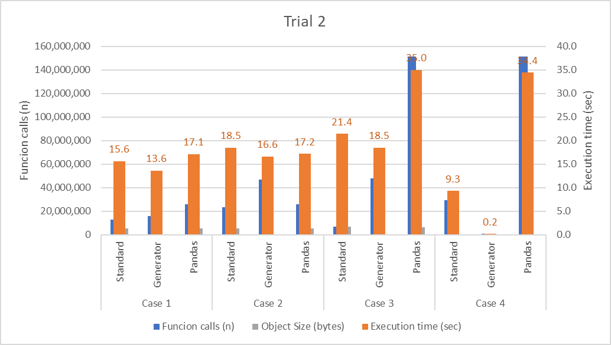
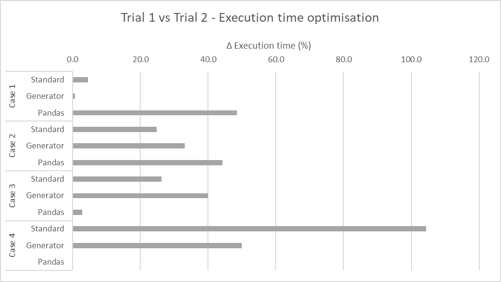
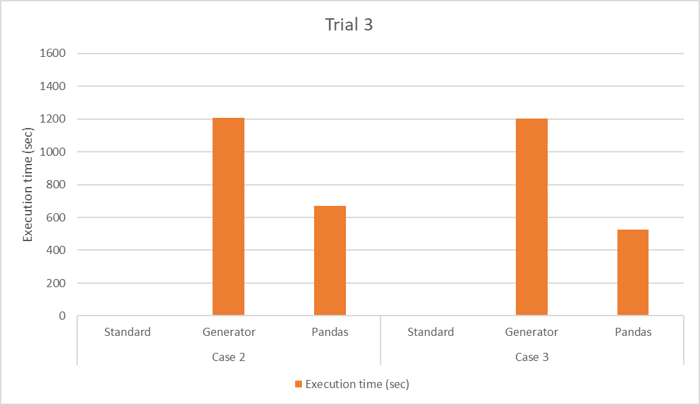

## Python vs Pandas In-Memory Data Processing Summary

The purpose of this project was to compare Python's and Pandas' ability to process large datasets in-memory. Whilst in-memory processing challenges
have largely been resolved, particularly with distributed computing frameworks such as Spark, Hadoop and Dask, and non-distributed frameworks such 
as Polars and DuckDB, I wanted to investigate if it were possible just using Python and Pandas. The main challenge with processing a large dataset 
on one computer is that the computer may not be able to allocate enough memory to process the data, resulting in OOM (out of memory) errors. 
Additionally, execution speed can be a problem with native Python meaning that optimisation would likely be required.

### Project Objective

The objective of this project was three-fold:

* Using red, green, refactor and TDD (test-driven development) to create a Python class that has data transformation capabilities that are similar to
  Pandas (Pandas is a large and complex tool therefore the Python class would be very simplified in comparison)
* Create two Python class versions: one class processes data completely in memory, whilst the other uses generators
* Compare the two Python class versions to Pandas and optimise both the Python classes and Pandas, where necessary

### Creating a Python Data Transformation Class

A Python class was used to organise all the functions as methods. The main reason a class was used instead of functions, was for the ability of
methods to be dot chained together for ease-of-use and readability. Note that dot chaining can also be used in Pandas, however, this is not always
possible with all methods.

The methods created in the Python data transformation classes are as follows:

| Method   | Description                                                                                      | Pandas equivalent |
|----------|--------------------------------------------------------------------------------------------------|-------------------|
| topr()   | Returns top number of rows. Mainly used for transformation testing and data exploration.         | head()            |  
| filtr()  | Returns rows containing one or more keywords either from a specified column or from all columns. | multiple ways     |
| repv()   | Replaces values either from a specified column or from all columns.                              | replace()         |
| delc()   | Deletes one or more columns based on column index.                                               | drop()            |
| tolist() | Outputs the transformed data to a list.                                                          | tolist()          |
| tocsv()  | Outputs the transformed data to a csv file.                                                      | to_csv()          |

The classes consisted of the `__init__` method with a single argument called "filepath", which is the local path of the csv file that is to be
processed. To read the csv file:

* Standard Class: Opens the csv file using a context manager and then appends to new list with for loops
* Generator Class: Opens the csv (without a context manager) and then uses the csv modules reader() method. The csv reader method uses a generator to
  read in each line everytime its `__next__` method is called.

Pandas reads the csv file with the read_csv() method. Pandas ability to read a csv quickly is widely considered excellent and much faster than 
other methods such as Python's native csv.reader() method.

### Test driven development

Before developing the Standard Class, a csv called "techcrunch.csv" was downloaded from the following link (https://github.com/realpython/materials/blob/master/generators/techcrunch.csv), and then was manually edited and saved in tests/unit/unit_test_data with a 
filename that reflected the unit test to be performed. The specific test was written using Python's native Unittest package and then the code was 
written so that first it failed (red) and then eventually passed (green). Refactoring was completed after to create the Generator Class and also 
to speed up execution.

## Benchmark trials

The benchmark trials were completed with region41_en.csv file located at the following link 
(https://www.kaggle.com/datasets/ekibee/car-sales-information). This dataset was mainly selected for its relatively large (but still small size) size 
(~0.33 Gb), resulting in (what was initially thought to be) an accurate reflection of how the Python Classes and Pandas' would behave with a much larger 
dataset (see Trial 3 to understand that this wasn't at all true). Additionally, this dataset was simple, easy to understand and given it's size, 
gave quick feedback after making modifications/optimisations.

### Cases

##### Case 1:

```
filter_words = ['Toyota']
replace_words = {'Land Cruiser': 'Sea Surfer'}
delete_cols_index = [2, 5] # Used with the Standard and Generator Classes
delete_cols_name = ['bodyType', 'year'] # Used with Pandas
```

##### Case 2:

```
filter_words = ['Toyota']
replace_words = {'Land Cruiser': 'Sea Surfer'}
delete_cols_index = [2, 5] # Used with the Standard and Generator Classes
delete_cols_name = ['bodyType', 'year'] # Used with Pandas
```

##### Case 3:

```
filter_words = ['Toyota','Nissan','Volkswagen']
replace_words = {'Land Cruiser': 'Sea Surfer', 'X-Trail': 'Trail-Z','Tiguan': 'Siguan'}
delete_cols_index = [2, 5, 6, 8] # Used with the Standard and Generator Classes
delete_cols_name = ['bodyType', 'year', 'mileage', 'power'] # Used with Pandas
```

##### Case 4:

```
filter_words = ['Toyota','Nissan','Volkswagen']
top_rows = 10,000
replace_words = {'Land Cruiser': 'Sea Surfer', 'X-Trail': 'Trail-Z','Tiguan': 'Siguan'}
delete_cols_index = [2, 5, 6, 8] # Used with the Standard and Generator Classes
delete_cols_name = ['bodyType', 'year', 'mileage', 'power'] # Used with Pandas
```

### Trial 1 - Initial Results

Below are the results of the benchmark trials with the unoptimised Classes and Pandas code.



#### Results and discussion

Across all cases in trial 1, the Generator Class is the fastest, followed by the Standard Class and then Pandas. Significant improvements in speed
are apparent with the topr() method in the Generator Class, which makes sense as generators process the data line-by-line until the required
number of rows in the topr() are returned.

When profiling the execution in cProfile, it was evident that the following were the bottlenecks that should be optimised:

##### Standard Class

See below the number of calls and the total time to complete the number of calls from **Case 1**, using cProfiler.

``` 
   ncalls  tottime  percall  cumtime  percall filename:lineno(function)
 10977257    4.955    0.000    4.955    0.000 {built-in method builtins.sorted}
  1498741    4.908    0.000    4.908    0.000 {method 'split' of 'str' objects}
        1    3.464    3.464    8.991    8.991 trial1_norm.py:8(__init__)
   645720    1.648    0.000    1.648    0.000 trial1_norm.py:83(replace_values) 
   ```

The largest bottleneck in the Standard Class in the built-in sorted(), unfortunately, I could not think of a way to optimise this because it is
critical for the delc() (delete columns) method. For example, if the indexes to be deleted are [1, 4, 6], then without the reverse then it will
delete index 1 first, which will result in index [4] becoming index [3] and index [6] becoming index [5]. When reversing the indexes, they stay in
their correct order and the correct columns are deleted.

The next largest bottleneck was the split() method, which was used to split each line's values (e.g. for csv a line could be: value 1, value 2,
value 3 etc.) into list values. To optimise this, I used the csv module's csv.reader() to try and remove this bottleneck. See results in Trial 2 for
performance improvement.

##### Generator Class

See below the number of calls and the total time to complete the number of calls from **Case 2**, using cProfiler. I chose Case 2 because the
performance in Case 2 is more "worst-case" compared to Case 1.

```
   ncalls  tottime  percall  cumtime  percall filename:lineno(function)
   645721    8.954    0.000   20.852    0.000 trial1_gen.py:38(<genexpr>)
  1498740    7.259    0.000    7.259    0.000 {method 'search' of 're.Pattern' objects}
   645720    3.610    0.000    7.081    0.000 trial1_gen.py:64(<listcomp>)
 10977257    3.471    0.000    3.471    0.000 {built-in method builtins.sorted}
```

The largest bottleneck occurs in line 38 and in the re.search pattern, which occurs in the filtr() method. See the following line:

```
37: value_pattern = "|".join(r"\b{}\b".format(v) for v in value)
38: self.reader = (
39:     row for row in self.reader if re.search(value_pattern, ",".join(row), re.IGNORECASE))
```

Upon investigating the bottleneck further, it appears that I had an error in the test csv file that I used for the unit test assertion, resulting in
using of regex when I could have just used the inbuilt Python string methods to create the solution instead. See results in Trial 2 for performance
improvement. Note that the optimisation was applied to both the Standard and Generator Classes.

##### Pandas

See below the number of calls and the total time to complete the number of calls from **Case 3**, using cProfiler. I chose Case 3 because the
performance in Case 2 is more "worst-case" compared to the other cases. Note that Pandas is called entirely within the Case file and not a separate
Python file.

```
   ncalls  tottime  percall  cumtime  percall filename:lineno(function)
100462040   24.300    0.000   24.300    0.000 trial1_case3.py:59(<genexpr>)
 25478583   15.155    0.000   39.366    0.000 {built-in method builtins.any}
 25478580   12.091    0.000   51.546    0.000 trial1_case3.py:59(<lambda>)
       17    8.155    0.480   59.706    3.512 {pandas._libs.lib.map_infer}
```

Clearly, the largest bottleneck is again the filter step, which is shown below.

```
59: filtr = df[
		    df.applymap(lambda x: any(keyword in str(x) for keyword in filter_words)).any(
			    axis=1)]
```

After doing some research and testing some different approaches, the following astype().apply() method chain resulted in the lowest execution time.
However, it only worked when there was one keyword to filter. For multiple keywords, the previous applymap() method still had be used. As such,
an if statement was used to apply the astype().apply() method chain if len(filter_words) list was == 1, else, use the previous applymap() method.

```
59: filtr = df[df.astype(str).apply(
		lambda x: x.str.contains('|'.join(filter_words), regex=False)).any(axis=1)]
```

### Trial 2 - Optimisation of Classes and Pandas

#### Results and discussion

Shown below are the results of Trial 2 after applying the optimisations discussed in the previous section. Overall, the Standard and Generator
Classes showed similar changes in execution speed due to the optimisation of the filtr() method. Pandas was able to optimised but only for when
one keyword was being used in the equivalent filter method.



Shown below is the difference in execution speed as a percentage.



### Trial 3 - Testing on large dataset

Trial 3 was testing how the Standard and Generator Classes, and Pandas performs with a large dataset (~10.7 Gb). Given the large run times, only
Cases 2 and 3 were trialled and the number of function calls omitted. See below the cases used:

##### Case 2:

```
filter_words = ['Laboratory-confirmed case']
replace_words = {'Black, Non-Hispanic': 'Black and Non-Hispanic'}
delete_cols_index = [8] # Used with the Standard and Generator Classes
delete_cols_name = ['hosp_yn'] # Used with Pandas
```

##### Case 3:

```
replace_words = {'Missing': '', 'Unknown': '', ', Non-Hispanic': '', '"': ''}
delete_cols_index = [8] # Used with the Standard and Generator Classes
delete_cols_name = ['hosp_yn'] # Used with Pandas
```

#### Results and discussion

Shown below are the results of Trial 3. Whilst the Generator Class performed better with a smaller dataset (~0.33 Gb), on a significantly larger 
dataset (~10.7 Gb), it was evident that Pandas performed a lot better with an execution time that was approx. half that of the Generator Class. 
Note that the Standard Class resulted in a memory error, therefore, it could not handle the dataset in-memory. The Generator class using the topr() 
did have excellent performance, however, this would only be used for data investigation and is unlikely to be used for transformation of datasets.

It's important to note that Pandas was developed to fast, which is generally attributed to being developed in C. Given that Pandas performed so 
much faster than the Generator Class, it was decided that a larger than memory dataset was not going to be tested.



### Final Conclusion

The results showed that libraries developed specifically for a purpose (such as Pandas) are likely to outperform solutions developed in Python 
given that they are developed to be highly performant. This is of course no surprise as information is freely available online around this topic. 
Nevertheless, the study was worthwhile in that an increased understanding of Python classes, data transformations and optimisation techniques was 
developed.